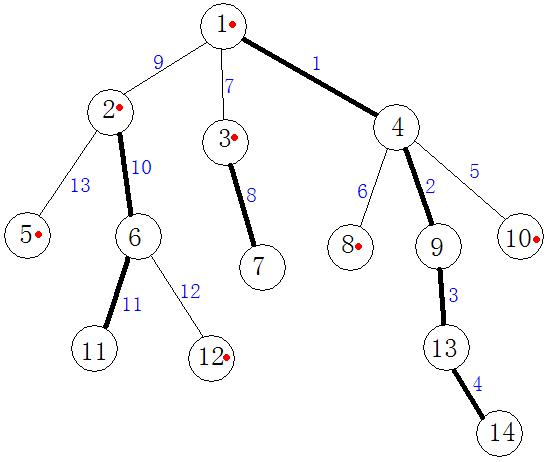

# Algorithms

### 1. Tree Chain Segmentation (TCS) algorithm

There are some problem about tree path modification and path information query.  These tree problems can be solved by using Tree Chain Segmentation (TCS) data structure.  There are two ways to divide the tree chain:

- heavy chain segmentation: based on the size of sub-tree
- long chain segmentation: based on the length of the tree chain

Here I discuss the heavy chain segmentation.  The long chain segmentation is similar.  Which one should be used depends on the application.

The chain is similar to what I defined in [Circus (USACO 2020 Open) problem](/2020_03Open/README.md#3-circus).  It is actually a path from one node to another node.  Here I add the following definition:

- heavy son: The root of one sub-tree with maximum nodes among all sub-trees
- light son: The root of other sub-trees
- heavy link: The tree link to its heavy son
- light link: The tree link to its light son
- heavy chain: the chain (path) containing only heavy links.
- light chain: the chain (path) containing only light link(s).

In the following graph, the bold chain is heavy chain while the others are light chains.  The node and link are re-numbered so that we can use segment tree to store the data related to node or path.

The tree chain segmentation is based on heavy chain.  Here are the data structure:

- sz[MX]: tree size
- fa[MX]: parent
- dep[MX]: depth
- son[MX]: heavy son
- top[MX]: top of one chain or node, it can also be the top of a link.

The top[] is the top node of one chain heavy or light chain, for example, the top of node 9, 14 is 1, and the top of 8 is 4.

#### Application

##### LCA (u,v) problem

- Linked list: find the path from root to u and v by DFS.  Time complexity O(N)
- Parent pointer with level: setup parent pointer and level, then do a query. 
- Segment tree (RMQ) : 
- Tarjan offline algorithm: support multiple query in one DFS
- TLS : [online algorithm](tls_lca.cpp)

##### Another Problem, similar to [snow painting](/2019_12Dec/README.md#2-bessies-snow-cow)

There is a tree, consisting of N nodes connected by N−1 links, each connecting a pair of nodes such that there is a unique path between every pair of nodes.  Every node has a value.  The following operations are supported:

- 1 x y z : Add z to the node from the path from x to y (including x, y).
- 2 x y: query the sum of values of all nodes on the path from x to y (including x, y).
- 3 x z: Add z to all the node in the subtree with x as the root (including x).
- 4 x : query the sum of all node in the subtree with x as the root (including x).

Input Format:

- First line N,M,R,P: The number of nodes, the number of operations, root node, and modulo P
- Next line has N positive integers: the initial value of N nodes
- Next (N-1) lines of two integers: the tree link between node x and y
- Next M line of operation, each line is in the format above.

Output Format

- For each query of type 2 and 4, Output the remainder when answer is divided by P

Sample Input

    5 5 2 24
    7 3 7 8 0
    1 2
    1 5
    3 1
    4 1
    3 4 2
    3 2 2
    4 5
    1 5 1 3
    2 1 3

Sample Output

    2
    21

Scoring:

- Test cases 2-4 satisfy: N in [1,10], M in [1,10]
- Test cases 5-9 satisfy: N in [1,1000], M in [1,1000]
- Test cases 10-20 satisfy: N in [1,100000], M in [1,100000]

### FFT
